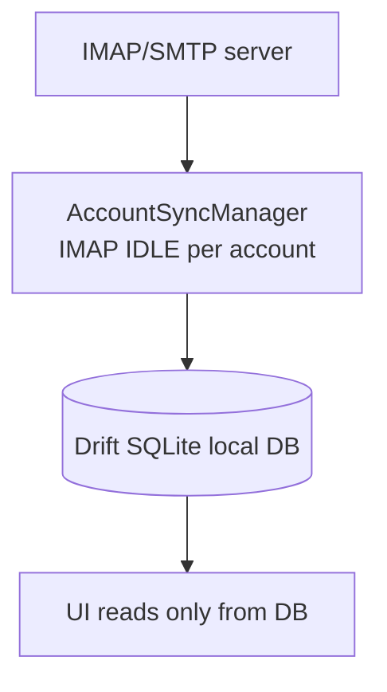

# SharedInbox 

IMAP/SMTP email client written in [Flutter](https://flutter.dev).

Targets **Android, iOS, and Desktop** (Linux done; macOS, Windows, Android, iOS scaffolded).
Supports **multiple accounts** — each synced independently via IMAP IDLE.

## Design philosophy: offline-first



The UI never touches the network. The sync engine runs in the background and writes to a local [Drift](https://drift.simonbinder.eu/) database. Screens observe reactive streams from that DB.

## Platform support

| Platform | Status |
| --- | --- |
| Linux desktop | Working (`task run`) |
| Android | APK builds (`task build-android`) |
| macOS desktop | Scaffolded |
| Windows desktop | Scaffolded |
| iOS | Scaffolded |

## Key packages

| Package | Role |
| --- | --- |
| [`enough_mail`](https://pub.dev/packages/enough_mail) | IMAP / SMTP / MIME |
| `drift` | Local SQLite ORM (offline-first store) |
| `flutter_riverpod` | State management / DI |
| `go_router` | Navigation |
| `flutter_secure_storage` | Password storage |

---

## For users

Run the app, tap **+**, and enter your IMAP/SMTP server details. The app syncs your INBOX in the
background using IMAP IDLE and works offline — the network is only needed during initial sync and
when sending mail.

For well-known providers you only need to type your email address — the servers are filled in
automatically. **Gmail** users see this: enter your `@gmail.com` (or `@googlemail.com`) address and
authenticate with a Google [App Password](GMAIL.md). See [GMAIL.md](GMAIL.md) for details and the
plan for one-tap Google sign-in.

### Install on Linux with mise

[mise](https://mise.jdx.dev/) installs SharedInbox from this repository's GitHub Releases — no
package manager entry and no plugin repo required:

```bash
mise use -g github:guettli/sharedinbox@latest   # or: @0.1.2 to pin a version
sharedinbox
```

If the short form above does not put `sharedinbox` on your `PATH`, spell the options out in
`~/.config/mise/config.toml` (this exact block is what CI verifies on every release):

```toml
[tools."github:guettli/sharedinbox"]
version = "latest"
asset_pattern = "sharedinbox-*-linux-x86_64.tar.gz"
strip_components = 1
bin_path = "."
filter_bins = ["sharedinbox"]
```

`strip_components = 1` unwraps the tarball's top-level directory so the executable keeps its
`data/` and `lib/` siblings — the Flutter runner resolves both relative to the binary. `bin_path`
plus `filter_bins` then put only `sharedinbox` on `PATH`, not the bundled `lib/*.so`.

Upgrade with `mise up sharedinbox`. The app detects a mise install and shows that command instead
of a download link.

**Runtime prerequisites.** mise ships the app, not system libraries. On Debian 13+ / Ubuntu 24.04+:

```bash
sudo apt install libgtk-3-0t64 libsecret-1-0 libgcrypt20 libjsoncpp25 zenity xdg-utils
```

Two package names vary by distribution: on releases older than the 64-bit `time_t` transition GTK is
`libgtk-3-0`, and Debian 13 ships jsoncpp as `libjsoncpp26` rather than `libjsoncpp25`.

* **libsecret + a running keyring** (gnome-keyring, KWallet, …) is required, not optional: account
  passwords go through `flutter_secure_storage`, so without a keyring service **login fails**.
* `zenity` (or an XDG desktop portal) backs the attachment file picker; `xdg-utils` opens
  downloaded attachments in your other apps.
* **glibc floor: 2.39.** The release tarball is built on Ubuntu 24.04, so it runs on Ubuntu 24.04+
  and Debian 13+. Older distributions need a build from source.

**Menu entry (optional).** A mise install puts nothing in your application menu. The tarball ships
the files for it; link them into your user directories:

```bash
DIR=$(dirname "$(mise which sharedinbox)")
mkdir -p ~/.local/share/applications ~/.local/share/icons/hicolor/512x512/apps
cp "$DIR/share/icons/hicolor/512x512/apps/sharedinbox.png" \
   ~/.local/share/icons/hicolor/512x512/apps/
sed 's|^Exec=sharedinbox$|Exec=mise x -- sharedinbox|' \
   "$DIR/share/applications/sharedinbox.desktop" \
   > ~/.local/share/applications/sharedinbox.desktop
update-desktop-database ~/.local/share/applications
```

`mise x -- sharedinbox` resolves the current version at launch time, so the entry keeps working
after `mise up` — a hard-coded install path would not.

### Troubleshooting

**"TLS handshake aborted" when opening Remote email filters (ManageSieve, port 4190)**

The app speaks ManageSieve with STARTTLS over the plaintext port (RFC 5804). If the screen shows
*"TLS handshake aborted on …:4190 — the connection was closed during TLS negotiation"*, the most
likely causes are:

1. The server advertises `STARTTLS` but has no usable certificate bound to that listener — the
   server aborts the handshake after the `ClientHello`.
2. A firewall or proxy in front of the mail server is dropping TLS connections to port 4190.
3. The server is configured for implicit TLS on this port while the app uses STARTTLS (or vice
   versa). Toggle **SSL/TLS** in the account's ManageSieve settings.

To check from a workstation:

```bash
openssl s_client -starttls sieve -connect mail.example.com:4190 -servername mail.example.com
```

If `openssl` also reports the connection closing during negotiation, the problem is on the server
side (check the ManageSieve listener config and certificate) or on the network path.

**A filter's folder does not receive new messages**

Server-side Sieve runs at delivery time on the mail server, so its *runtime* errors are written only
to the **mail server's own logs** — no mail protocol (ManageSieve or JMAP) hands them back to a
client, so the app cannot display them. The common causes the app *can* check for you are, in the
**Remote email filters** list, the ⋮ menu → **Diagnose**:

1. **The filter is not active.** The server only runs the active script; an inactive filter (shown in
   orange) never sees incoming mail. Use **Set active**.
2. **The target folder does not exist.** A `fileinto "Foo"` cannot file into `Foo` unless that folder
   already exists (or the rule uses `fileinto :create "Foo"`).
3. **Nothing matches.** The conditions may simply not match the mail you expect.

If Diagnose reports no local problem, the filter reached the server correctly and any remaining
failure is in the server's delivery pipeline — check the mail server's log (for Stalwart, its
tracing/log output) for the Sieve execution.

---

## For developers

### Prerequisites

[Nix](https://nixos.org/download) with flakes enabled and [direnv](https://direnv.net/).

```bash
# One-time: allow direnv to load the Nix dev shell
direnv allow

# One-time: install the pinned Flutter version (fvm is provided by Nix)
fvm install
```

`direnv` loads the Nix flake automatically — it provides go-task, fvm, Android SDK, Stalwart, and Linux build tools. Flutter itself is managed by FVM (pinned in `.fvmrc`) rather than Nix, which avoids glibc compatibility issues on non-NixOS hosts. `task check` also runs `fvm install` automatically if Flutter is missing.

### First-time setup

```bash
# Generate the Drift database layer (required before first build)
task codegen

# Verify everything compiles and tests pass
task check
```

### Daily workflow

```bash
task analyze          # flutter analyze (uses analysis_options.yaml)
task test             # pure-Dart unit tests + coverage gate (≥85%)
task test-widget      # widget tests — headless, no device needed
task test-flutter     # full Flutter test suite (unit + widget + integration)
task integration      # IMAP/SMTP integration tests via local Stalwart server
task build-linux      # flutter build linux --debug (compile check)
task run              # flutter run -d linux
task analyze-fix      # dart fix --apply
```

`task check` runs `analyze` + `test` + `test-widget` + `build-linux` + `integration` in parallel — use it before every commit.

### Running the app on desktop in mobile screen resolution

Start the app on the Linux desktop target:

```bash
task run   # or: flutter run -d linux
```

After the window opens, resize it to a phone-like size. Typical reference dimensions:

| Device profile | Width × Height |
| --- | --- |
| Compact phone (e.g. Pixel 6a) | 360 × 800 |
| Large phone (e.g. iPhone 14 Pro) | 393 × 852 |
| Tall phone (e.g. Samsung S24) | 360 × 780 |

Drag the window border to those dimensions, or use your window manager's "set window size" feature. The Flutter layout engine responds to the window size exactly as it would on a real device — breakpoints, overflow, and scrolling behave identically. Hot-reload (`r` in the terminal) preserves the window size between reloads.

### Building and installing an Android APK

Build a release APK with:

```bash
task build-android   # or: flutter build apk --release
```

The signed APK is written to:

```text
build/app/outputs/flutter-apk/app-release.apk
```

**Install via ADB** (USB cable or Wi-Fi ADB, device must have "Install from unknown sources" enabled):

```bash
adb install build/app/outputs/flutter-apk/app-release.apk
```

**Install by side-loading** (no cable):

1. Copy `app-release.apk` to the device (e.g. via USB file transfer, cloud storage, or `adb push`).
2. Open a file manager on the device, tap the `.apk` file, and confirm the install prompt.

> **Tip — split APKs for smaller size:** `flutter build apk --split-per-abi` produces three smaller APKs (one per CPU architecture). Install the one matching the device: `app-arm64-v8a-release.apk` covers almost all modern Android phones.

### Cutting a Linux release (the mise channel)

Releases are hand-cut SemVer tags; the hourly `deploy.yml` snapshot channel
(`sharedinbox.de/builds` + `latest.json`) is separate and keeps running untouched.

```bash
# 1. Bump `version:` in pubspec.yaml, commit, and merge to main.
# 2. Tag main with v<that version> — the tag must match, release.yml refuses otherwise.
git tag v0.1.2 && git push origin v0.1.2
```

The `Release` workflow then runs `task release-linux` (builds the tarball and attaches it to the
GitHub Release) followed by `task check-mise-install`, which installs the release with mise in a
clean Ubuntu container and fails if the app does not survive 12 seconds under Xvfb.

To inspect a tarball without publishing anything:

```bash
task package-linux-release            # → build/sharedinbox-<version>-linux-x86_64.tar.gz
VERSION=0.1.2 task check-mise-install  # only after that version is published
```

Release builds carry a `RELEASE_VERSION` dart-define. That is what makes the in-app update check
compare against GitHub Releases instead of `latest.json`, whose `version` is a git hash and would
otherwise read as "newer" forever.

### Widget tests

`test/widget/` contains [Flutter widget tests](https://docs.flutter.dev/testing/overview#widget-tests) for every screen. They run headlessly — no display server, no device, no database, no network. Each test pumps the screen into a virtual render canvas and uses in-memory fakes for the Riverpod repository providers.

Run them locally:

```bash
task test-widget   # or: flutter test test/widget/
```

They also run in CI on every push (see the **Widget tests** step in `.github/workflows/ci.yml`).

### After changing the DB schema

Edit `lib/data/db/database.dart`, then:

```bash
task codegen   # regenerates lib/data/db/database.g.dart
```

`database.g.dart` is git-ignored; every developer must regenerate it after cloning or pulling schema changes.

### Integration tests

```bash
task integration
```

Starts a local [Stalwart](https://stalw.art) mail server on random ports, runs the tests in `test/integration/`, then stops it. No manual setup needed — Stalwart is provided by the Nix flake.

### Adding a screen

1. Create `lib/ui/screens/my_screen.dart` — extend `ConsumerWidget`.
2. Add a `GoRoute` in `lib/ui/router.dart`.
3. Read from Riverpod providers in `lib/di.dart`; never call the network directly from UI.

### Project layout

```text
lib/
  core/
    models/          — plain Dart data classes (Account, Email, Mailbox, …)
    repositories/    — abstract interfaces
    sync/            — AccountSyncManager (IMAP IDLE + backoff)
    utils/           — htmlToPlain, fmtSize (pure functions, unit-tested)
  data/
    db/              — Drift schema + generated code
    imap/            — connectImap / connectSmtp helpers
    repositories/    — concrete implementations
  ui/
    screens/         — one file per screen
    router.dart      — go_router route tree
  di.dart            — Riverpod providers
  main.dart          — entry point

stalwart-dev/        — local mail server config + start/test scripts
test/
  unit/              — pure-Dart unit tests (no device)
  widget/            — Flutter widget tests (headless, no device)
  integration/       — IMAP/SMTP tests against local Stalwart
```

---

## Working features

- **Multiple accounts** — add any number of IMAP/SMTP accounts; each syncs independently
- **IMAP IDLE** — background sync with push-like latency; exponential backoff (5 s → 5 min) on error
- **Mailbox list** — shows all folders with unread / total counts
- **Email list** — sender, subject, date; bold for unread; manual sync button
- **Email detail** — renders plain text; falls back to HTML→plain conversion; marks as read on open; shows attachment names and sizes
- **Reply / Reply all** — pre-fills To, Subject (`Re:`), Cc from original
- **Compose** — To, Cc, Subject, Body fields; sends via SMTP
- **Flag / unflag** — star button in detail view; amber star indicator in list; synced to server
- **Move to folder** — bottom-sheet folder picker; moves on server via IMAP MOVE
- **Attachment indicators** — paperclip icon in email list; filename + size in detail
- **Delete email** — removes from server (IMAP expunge) and local DB
- **Settings** — list and remove accounts
- **Search** — IMAP server-side search (subject + body); results shown inline, no navigation change
- **Offline-first** — all reads come from local Drift/SQLite DB; network only for sync and send
- **UnifiedPush** — opt-in real-time push without proprietary services. Pick any installed distributor under **Settings → UnifiedPush** and point a [relay](server/uprelay/README.md) at the resulting endpoint URL.
- **Notifications** — silent by default. Per account, turn on **Notifications** and add rules (a VIP sender, a subject keyword, or a full filter) so only the mail you care about pops up. Android and Linux.
